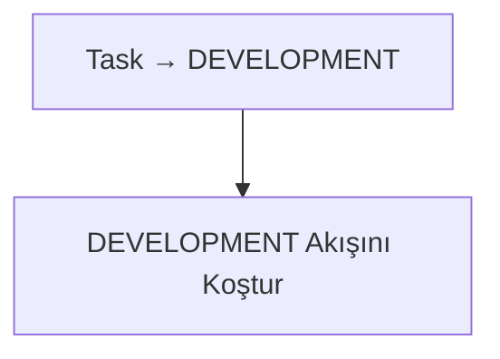

# Workflow: Analyse Done

Bu akış, `ANALYSE DONE` statüsündeki tasklar için kullanılır.

## Diagram

## Adımlar

### 1. Task → DEVELOPMENT
Task statüsü **DEVELOPMENT** olarak güncellenir.

### 2. DEVELOPMENT Akışını Koştur
`workflow/02-development.md` akışı baştan koşturulur.
